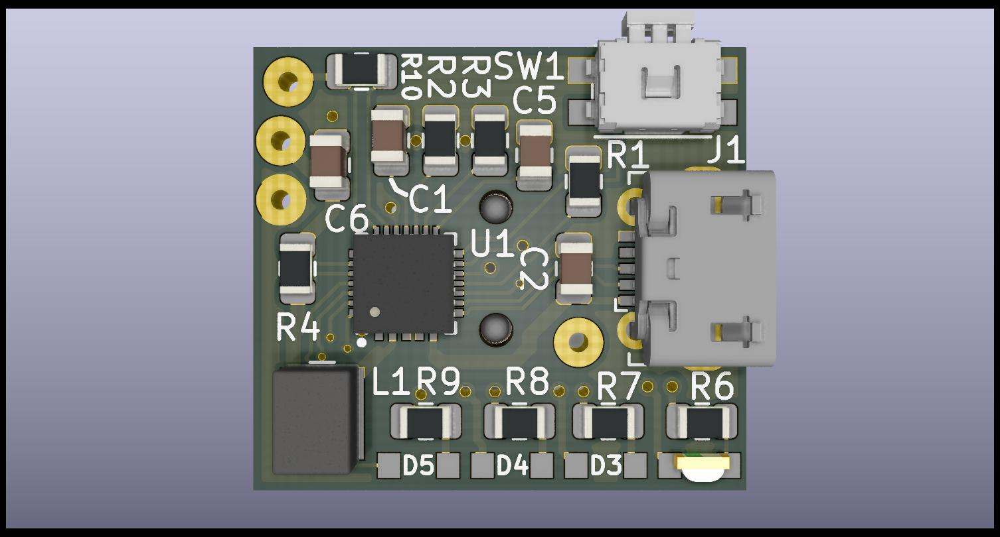
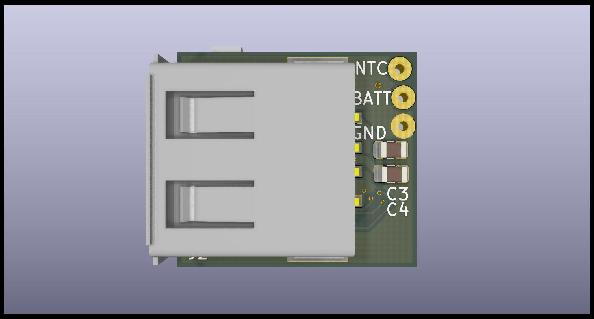

# Power Bank Upgrade

A replacement PCB for a cheap single cell power bank.

Designed with KiCad 5.0.2

PDF Schematics, Gerbers and Images are available in the "Docs" directory.

    
    

## Introduction

This is a single cell, Li-Ion USB Power bank based around an Monolitic Power 
Solutions MP2632B IC.

The board was designed to be broadly compatible with the plastics from a common
model of power bank available from Pound shops except with a few extra features.

## Features

* 3000 mAh LG HG2 Cell. 250% more capacity!
* State of Charge LED indicator.
* Faster Charge and Discharge Currents. (3A)
* Thermistor Thermal Regulation and Shutdown.
* Will actually charge a modern smartphone.

## Licence
The project is licenced under the MIT licence.